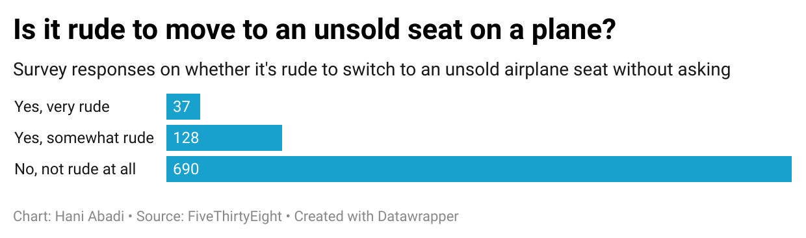

# flight-etiquette

Bar chart visualization from FiveThirtyEight's airplane etiquette survey using Datawrapper.

## Why I Chose This Question

I picked the question *“Is it rude to move to an unsold seat on a plane?”* because I tend to move once I hear the word boarding complete, it was an interesting insight and piqued my interest. 

## What the Chart Shows

The chart shows that the majority of respondents — 690 out of 1040 — believe it's **not rude at all** to switch to an unsold airplane seat without asking. Only a small number found it “somewhat rude” (128), and even fewer considered it “very rude” (37). This suggests that most people are ok with the seating switch.
## Chart Image

